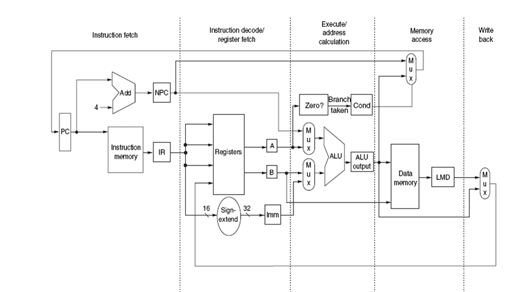

## ECE552: Introduction to Computer Architecture

This repository contains homework modules and a multi-stage CPU project completed for ECE552.

The codebase is now organized into two main areas:

- `homeworks/` for individual homework submissions
- `project/` for the course project stages (`phase1_files`, `phase2`, `phase3`)

## Architecture Reference

The top-level design intent is illustrated in:

- `architecture_diagram.png`



## Repository Layout

```text
ECE552/
	homeworks/
		HW/
		HW1/
		HW2/
		HW3/
		HW4/
		HW5/
		HW7/
		README.md
	project/
		phase1_files/
		phase2/
		phase3/
		README.md
	Useful_Files/
	architecture_diagram.png
	README.md
	TODO.txt
```

## What To Read First

1. `homeworks/README.md` for a quick outline of each homework.
2. `project/README.md` for how the CPU project evolved across three stages.
3. `project/README.md` (Run section) for simulation guidance based on the final implementation in `project/phase3/`.
